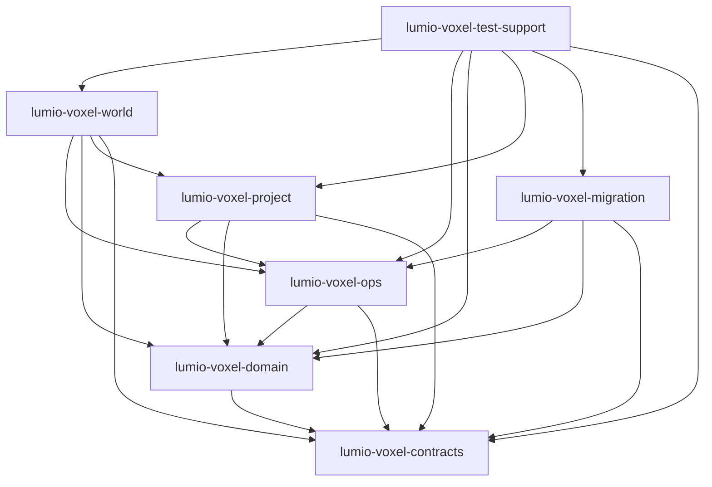

# LumioVoxelEngine V1.4 实现蓝图

> **Produces**：`VersionedImplementationBlueprintV14`
> **Baseline**：`LGE-V1.4-2026-08-27`
> **镜像**：[`docs/architecture/LumioGameEngine_Architecture_v1.4.md`](../architecture/LumioGameEngine_Architecture_v1.4.md)
> **仓内决策**：[0001](../../.spec/decisions/0001-snapshotcut-vs-capture-ref.md)–[0007](../../.spec/decisions/0007-v1.4-implementation-baseline.md)
> **本文不复制** Schema 字段、错误码数值、ID 布局或 VOX-D 默认值。公共类型只引用生成名。

本文是 V1.4 代码地图：七 crate DAG、十个逻辑模块落点、稳定方法名、crate-private 接口、失败语义、后续卡互斥文件集和共享热点所有者。逻辑模块仍是目录 / README 边界；物理 crate 以 [0006](../../.spec/decisions/0006-crate-map.md) 为准。

## 1. 七 crate DAG

只允许下列 crate。禁止 `lumio-voxel-persistence`、`lumio-voxel-runtime`、`lumio-voxel-ffi`、`lumio-voxel-common` 以及任何 generic common crate。

| Crate | 层 | 收录的逻辑模块 | 不收录 |
| --- | --- | --- | --- |
| `lumio-voxel-contracts` | L0 | 架构源生成 Schema / ID / 错误 / Capability 绑定 | 任何领域逻辑 |
| `lumio-voxel-domain` | L1+L2 | `chunk`、`revision`；`ReadView` / `WriteSet` / `CommitBatch` / Availability / Storage Port；PublishedState | query / mutation API；互调服务 |
| `lumio-voxel-ops` | L3 | `query`、`mutation`、`snapshot`、`streaming`（后两者可 feature 关闭） | 组合根；空间投影 |
| `lumio-voxel-project` | L4 | `spatial`、`mesh-collision`（可选 feature） | 权威写入 |
| `lumio-voxel-world` | L5 | `world` 组合根、Barrier、`IVoxelWorldPort` | Chunk 内部布局；Host / Runtime |
| `lumio-voxel-migration` | Tool | `migration` 节点提供者 | Tick 热路径 |
| `lumio-voxel-test-support` | 测试 | Reference / Golden / 故障注入 / Fixture harness | 生产默认依赖 |

```text
lumio-voxel-contracts
        ^
        |
lumio-voxel-domain  (chunk | revision sibling; L2 publication)
        ^
        |
lumio-voxel-ops     (query | mutation | snapshot | streaming)
        ^
        |
lumio-voxel-project (spatial | mesh-collision)
        ^
        |
lumio-voxel-world   (composition root; depends on enabled crates)

lumio-voxel-migration --> contracts + domain + ops(snapshot types)
                          不得依赖 world

lumio-voxel-test-support --> 各生产 crate（仅测试）
生产 crate 不得依赖 test-support
```



约束：

- `domain` 内 `chunk` 与 `revision` 禁止服务互调；可见发布只经 `mutation` 持有的受控 `CommitBatch`。
- L0–L4 与 Tool 不得依赖 `lumio-voxel-world`。
- `query` / `mutation` 不得反向依赖 `world`；投影只经 `ReadView`，不直连 Chunk Storage。
- Storage 后端经 domain 的 Storage Port 接入；第三方实现不得进入 `ops` / `world`。
- Foundation 最小集：`contracts` + `domain` + `ops`（query/mutation）+ `world` + `test-support`。`project`、`migration` 与 `ops` 的 snapshot/streaming feature 可按优先级后启。

## 2. 十模块落点

| 逻辑模块 | 层 | 物理 crate | 优先级 | 逻辑目录 |
| --- | --- | --- | --- | --- |
| world | L5 | `lumio-voxel-world` | P0 | `modules/world/` |
| chunk | L1 | `lumio-voxel-domain` | P0 | `modules/chunk/` |
| revision | L1 | `lumio-voxel-domain` | P0 | `modules/revision/` |
| query | L3 | `lumio-voxel-ops` | P0 | `modules/query/` |
| mutation | L3 | `lumio-voxel-ops` | P0 | `modules/mutation/` |
| snapshot | L3 | `lumio-voxel-ops` | P0 | `modules/snapshot/` |
| streaming | L3 | `lumio-voxel-ops` | P2 | `modules/streaming/` |
| spatial | L4 | `lumio-voxel-project` | P2 | `modules/spatial/` |
| mesh-collision | L4 | `lumio-voxel-project` | P2 | `modules/mesh-collision/` |
| migration | Tool | `lumio-voxel-migration` | P2 | `modules/migration/` |

跨模块、不属于第十一个逻辑模块的落点：

| 能力 | crate | 说明 |
| --- | --- | --- |
| 生成契约绑定 | `lumio-voxel-contracts` | 只读消费 V1.4 Artifact |
| `VoxelConfigSnapshot` | `lumio-voxel-domain` | 不可变配置快照 |
| PublishedState 原子根 | `lumio-voxel-domain` | L2 发布；ReadView/WriteSet/CommitBatch |
| OriginToken / 有界作业 | `lumio-voxel-ops` | SDK 中立完成信封 |
| `IVoxelWorldPort` 适配 | `lumio-voxel-world` | 生成 Port 总适配 |
| Reference / 故障注入 | `lumio-voxel-test-support` | 生产 crate 不反向依赖 |

## 3. 共享失败语义

全仓共用、不在此复制 Schema 字段：

- **缺 Chunk**：Query / Streaming 可用性必须是 `Ready` / `NotLoaded` / `Pending` / `Unavailable`。不得把缺失伪装成空世界或空气 Block。
- **RevisionConflict**：Expected Revision 不匹配时稳定拒绝，不静默覆盖。
- **Prepare 无可见副作用**：失败发生在 Reservation 建立之前或之内，不发布页、不递增公共 Revision。
- **Commit 按 TxnId 幂等**：重复 Commit 返回原结果；`Indeterminate` 不猜测成功。
- **首次可见写入之后失败**：`CommitBatch` publish 一旦开始可见交换，后续普通失败不可恢复；所属 World 进入 `Faulted`，停止新写入，由 Host 恢复。swap 前失败必须保持旧根字节不变。
- **Dirty 清除**：仅 Host `DurabilityAck` 经 world Barrier 到达 `chunk.clear_dirty`。
- **Restore ≠ Streaming Load**：`snapshot.decode` → `world.restore` → `chunk.materialize_pages` + `revision.restore_stamps`。
- **双实例隔离**：Authority / Replica / LocalEmbedded 两棵树不得共享对象、Buffer、锁、指针或 Revision 写入。

VOX-D-001–008 仍是决策门，本蓝图不给数值默认。

## 4. 共享热点所有者

并行卡不得改这些文件，除非自己是所有者。

| 热点 | 所有者 | 其他人 |
| --- | --- | --- |
| 根 `Cargo.toml` / `Cargo.lock` / `rust-toolchain` / `.cargo` | R-00041 | 不得改 |
| 七 crate 的 `Cargo.toml` / `lib.rs` | R-00041 | 不得改 |
| ADR 索引 `.spec/decisions/README.md` | R-00034（本卡） | 只新增自己的 ADR 文件时，索引增量交回本卡所有者 |
| 知识索引 `.spec/knowledge/README.md` | 无活卡独占；increment-only | 无权编辑时只在交回物提供可粘贴增量 |
| `docs/evidence/v1.4-generated-artifact-gate.md` | R-00037 | 不得改 |

## 5. 逐模块：稳定方法名、crate-private 接口、失败、互斥文件

方法名取自各模块 README 的 Port 表面，只列名字。crate-private 接口是 crate 内、不进入 `IVoxelWorldPort` 的类型与函数名。互斥文件集来自 Voxel 需求室 live cards 的 exclusive ownership（W0–W24）。

### 5.1 world → `lumio-voxel-world`

**稳定 Port 名**：`create_world`、`query`、`prepare_mutation`、`commit`、`abort`、`capture`、`apply_durability_ack`、`restore`、`quiesce`、`destroy`。

**crate-private**：`WorldState`、`WorldInstance`、`Admission`、`WriteLane`、`Barrier`、`Command`、`Routing`、`FaultIsolator`、`Shutdown`、`Diagnostics`、`CaptureAdmission`、`RestoreEntry`、`DurabilityAckApply`、`StreamingApply`、`StreamingAdmission`、`PortAdapter`、`error_mapping`、`ownership`。

**失败**：Context / Capability / 预算拒绝；销毁后迟到结果拒绝；P0 初始化失败逆序清理；可见 publish 失败后实例 `Faulted`。不拥有 `SnapshotCut`。

**互斥文件**：

| 卡 | 文件 |
| --- | --- |
| R-00116 | `crates/lumio-voxel-world/src/world/mod.rs`、`state.rs`、`instance.rs`、`admission.rs`；`crates/lumio-voxel-world/tests/world_lifecycle.rs` |
| R-00119 | `crates/lumio-voxel-world/src/world/write_lane.rs`、`barrier.rs`、`command.rs`、`routing.rs`；`tests/world_barrier.rs`、`world_command_order.rs` |
| R-00121 | `crates/lumio-voxel-world/src/world/fault.rs`、`events.rs`、`shutdown.rs`、`diagnostics.rs`；`tests/world_fault_isolation.rs`、`world_shutdown.rs` |
| R-00135 | `crates/lumio-voxel-world/src/world/capture.rs`、`capture_admission.rs`；`tests/world_capture.rs` |
| R-00136 | `crates/lumio-voxel-world/src/world/restore.rs`；`tests/world_restore.rs`（decode 侧见 snapshot） |
| R-00137 | `crates/lumio-voxel-world/src/world/durability_ack.rs`；`tests/durability_ack_apply.rs` |
| R-00142 | `crates/lumio-voxel-world/src/port/mod.rs`、`adapter.rs`、`error_mapping.rs`、`ownership.rs`；`tests/generated_port_adapter.rs` |
| R-00155 | `crates/lumio-voxel-world/src/world/streaming_apply.rs`、`streaming_admission.rs`；`tests/streaming_apply.rs`、`streaming_restore_exclusion.rs` |

### 5.2 chunk → `lumio-voxel-domain`

**稳定 Port 名**：`create`、`read`、`borrow_read`、`borrow_write`、`publish`、`clear_dirty`、`materialize_pages`、`seal_page`、`validate`、`unload`。

**crate-private**：`ChunkPayload`、`ChunkSlot`、`DirectoryRoot`、`StagedDelta`、`DirtyFrontier`、`ReplacementRoot`、`ReadView`、`WriteSet`、`StoragePort`。不暴露 Storage 指针。不调用 revision 服务。

**失败**：四态非法转换无副作用；越界 / 损坏页稳定拒绝；`publish` 中途失败则 World `Faulted`；未获 Ack 的 Dirty 不得 `Unloaded`。

**互斥文件**：

| 卡 | 文件 |
| --- | --- |
| R-00073 | `crates/lumio-voxel-domain/src/chunk/mod.rs`、`payload.rs`、`slot.rs`、`directory.rs`；`tests/chunk_state_machine.rs` |
| R-00076 | `crates/lumio-voxel-domain/src/chunk/delta.rs`、`dirty.rs`、`replacement.rs`；`tests/chunk_delta_dirty.rs` |

### 5.3 revision → `lumio-voxel-domain`

**稳定 Port 名**：`current_world`、`current_chunk`、`observe`、`check`、`pin`、`release`、`advance`。crate-private 恢复入口：`restore_stamps`。

**crate-private**：`RevisionAllocator`、`RevisionStamp`（生成类型映射）、`ReadViewPin`、`RetentionFrontier`、`SnapshotPin`。不复用已分配 Revision。

**失败**：`check` 失败返回 `RevisionConflict`；abandon / 重复 finalize / 溢出稳定拒绝且不复用；Pin 超限与跨 World 无共享。

**互斥文件**：

| 卡 | 文件 |
| --- | --- |
| R-00070 | `crates/lumio-voxel-domain/src/revision/mod.rs`、`allocator.rs`、`stamp.rs`；`tests/revision_allocator.rs` |
| R-00071 | `crates/lumio-voxel-domain/src/revision/read_view.rs`、`pin.rs`、`retention.rs`；`tests/revision_read_view.rs` |

### 5.4 query → `lumio-voxel-ops`

**稳定 Port 名**：`begin`、`poll`、`cancel`、`read_at`。

**crate-private**：`QueryPlan`、`Budget`、`Validate`、`Execute`、`ChunkAccess`、`ResultAssembly`。计划绑定单一 ReadView / configHash，不执行 I/O、不发 Load。

**失败**：缺 Chunk 映射为 `Ready` / `NotLoaded` / `Pending` / `Unavailable`；超预算 / 取消发生在执行前则 World 状态不变；continuation 不得改观察 Revision。

**互斥文件**：

| 卡 | 文件 |
| --- | --- |
| R-00080 | `crates/lumio-voxel-ops/src/query/mod.rs`、`plan.rs`、`budget.rs`、`validate.rs`；`tests/query_planner.rs` |
| R-00081 | `crates/lumio-voxel-ops/src/query/execute.rs`、`chunk_access.rs`、`result_assembly.rs`；`tests/query_execution.rs`、`query_missing_states.rs` |

### 5.5 mutation → `lumio-voxel-ops`

**稳定 Port 名**：`prepare`、`commit`、`abort`、`status`。

**crate-private**：`CanonicalFingerprint`、`ReceiptLedger`、`Reservation`、`Preconditions`、`MutationPlan`、`PreparedVoxelToken`、`CommitFinalize`、`CommitBatch`（调用 domain）。Prepare 无可见副作用。

**失败**：`RevisionConflict`、Chunk 未就绪、容量 / 租约 / Context 失败均在可见写入前拒绝；Commit 可见交换失败则 World `Faulted`；重复 `TxnId` 返回原 receipt。

**互斥文件**：

| 卡 | 文件 |
| --- | --- |
| R-00093 | `crates/lumio-voxel-ops/src/mutation/mod.rs`、`fingerprint.rs`、`receipt_ledger.rs`、`reservation.rs`；`tests/mutation_receipt.rs` |
| R-00096 | `crates/lumio-voxel-ops/src/mutation/preconditions.rs`、`plan.rs`、`prepare.rs`、`prepared_token.rs`；`tests/mutation_prepare.rs` |
| R-00104 | `crates/lumio-voxel-ops/src/mutation/commit.rs`、`commit_finalize.rs`；`tests/mutation_commit.rs`、`mutation_atomic_batch.rs` |

### 5.6 snapshot → `lumio-voxel-ops`

**稳定 Port 名**：`capture`、`diff`、`encode`、`decode`、`release`。

**crate-private**：`VoxelCaptureRef`、`ManifestAdapter`、`CodecPort`、`RestoreShadow`、`RestorePreflight`。不拥有 `SnapshotCut`、文件、fsync 或 WAL。契约为架构源 ADR-035（V1.4 已冻结）。

**失败**：校验失败不物化；Restore 不走 Streaming Load；编码取消归还 Pin。Host 才做耐久。

**互斥文件**：

| 卡 | 文件 |
| --- | --- |
| R-00134 | `crates/lumio-voxel-ops/src/snapshot/mod.rs`、`capture_ref.rs`、`manifest_adapter.rs`、`codec_port.rs`；`tests/snapshot_capture_ref.rs` |
| R-00136 | `crates/lumio-voxel-ops/src/snapshot/decode.rs`、`restore_shadow.rs`、`restore_preflight.rs`；world restore 文件见 5.1 |

### 5.7 streaming → `lumio-voxel-ops`

**稳定 Port 名**：`request_load`、`request_unload`、`cancel`、`poll_status`、`drain`。

**crate-private**：`Demand`、`Ticket`、`Coordinator`、`SourcePort`、`Fetch`、`Decode`、`SealedCompletion`。最终 Apply 在 world Barrier。契约为架构源 ADR-036（V1.4 已冻结）。

**失败**：`poll_status` 只返回四态可用性；队列满 / 过期 ticket / 错误 World 不得静默丢失；Dirty Unload 必须已 Ack。

**互斥文件**：

| 卡 | 文件 |
| --- | --- |
| R-00151 | `crates/lumio-voxel-ops/src/streaming/mod.rs`、`demand.rs`、`ticket.rs`、`coordinator.rs`、`source_port.rs`；`tests/streaming_coordinator.rs` |
| R-00153 | `crates/lumio-voxel-ops/src/streaming/fetch.rs`、`decode.rs`、`completion.rs`、`cancel.rs`；`tests/streaming_worker.rs` |
| R-00155 | world Apply 文件见 5.1 |

### 5.8 spatial → `lumio-voxel-project`

**稳定 Port 名**：`project`、`candidates`、`invalidate`、`cancel`。

**crate-private**：`Candidate`、`Occlusion`、`KernelPort`、`SpatialCache`、`Invalidation`、`ProjectionTask`、`SourceRouter`。只经 query ReadView。无跨仓 Spatial Schema。

**失败**：缺 Chunk 透传四态；跨 World / 跨 Revision 不得命中旧缓存；取消不进入 Gameplay 裁决。

**互斥文件**：

| 卡 | 文件 |
| --- | --- |
| R-00163 | `crates/lumio-voxel-project/src/spatial/mod.rs`、`candidate.rs`、`occlusion.rs`、`kernel_port.rs`；`tests/spatial_projection.rs` |
| R-00166 | `crates/lumio-voxel-project/src/spatial/cache.rs`、`invalidation.rs`、`completion.rs`；`tests/spatial_cache.rs` |
| R-00182 | `crates/lumio-voxel-project/src/projection/mod.rs`、`request.rs`、`task.rs`、`source_router.rs`、`completion.rs`；`tests/projection_router.rs` |

### 5.9 mesh-collision → `lumio-voxel-project`

**稳定 Port 名**：`build_mesh`、`build_collision`、`invalidate`、`cancel`、`evict`。

**crate-private**：`MeshBuilder`、`CollisionBuilder`、`KernelAdapter`、`CacheKey`。P2；不拥有 Renderer / Physics Gameplay。

**失败**：邻接 Chunk 缺失不得静默成空几何；缓存键必须带 World / Revision；取消丢弃未完成 Source。

**互斥文件**：

| 卡 | 文件 |
| --- | --- |
| R-00193 | `crates/lumio-voxel-project/src/mesh/mod.rs`、`request.rs`、`builder.rs`、`kernel_adapter.rs`、`cache_key.rs`；`tests/mesh_source.rs` |
| R-00194 | `crates/lumio-voxel-project/src/collision/mod.rs`、`request.rs`、`builder.rs`、`kernel_adapter.rs`、`cache_key.rs`；`tests/collision_source.rs` |

### 5.10 migration → `lumio-voxel-migration`

**稳定 Port 名**：`describe_nodes`、`run_node`、`verify_node`。不提供全图 `validate_manifest` 或 `request_activation`。

**crate-private**：`ManifestAdapter`、`Preflight`、`Node`、`Transform`、`Checkpoint`、`Runner`、`OutputValidator`、`FailureEvidence`。

**失败**：节点中断保留旧 Active（Host 所有）；Hash / toolVersion 不匹配拒绝；不得从 Tick 回调 world 写入。

**互斥文件**：

| 卡 | 文件 |
| --- | --- |
| R-00169 | `crates/lumio-voxel-migration/src/lib.rs`、`manifest_adapter.rs`、`preflight.rs`、`node.rs`、`transform.rs`；`tests/migration_node.rs` |
| R-00170 | `crates/lumio-voxel-migration/src/checkpoint.rs`、`runner.rs`、`output_validator.rs`、`failure_evidence.rs`；`tests/migration_replay.rs` |

## 6. 跨模块 Foundation 与验证卡互斥文件

| 卡 | 落点 crate / 文档 | 独占文件 |
| --- | --- | --- |
| R-00034 | 规范 / 蓝图 | `README.md`；`.spec/AGENTS.md`；`.spec/knowledge/standards/repository-architecture.md`；ADR 索引与 `0007-v1.4-implementation-baseline.md`；`modules/README.md` 及十个模块 README；`docs/plans/lve-v1.4-implementation-blueprint.md` |
| R-00037 | 证据 | `docs/evidence/v1.4-generated-artifact-gate.md` |
| R-00041 | 工作区 | 根 Cargo.toml / Cargo.lock / rust-toolchain / `.cargo`；七 crate Cargo.toml / lib.rs；crate DAG 与 generated-clean 工具与测试；`testing.md`；Repository Policy Cargo 段 |
| R-00045 | `lumio-voxel-contracts` | `crates/lumio-voxel-contracts/**`；该 crate 的 contract/fixture tests；Artifact 锁定与 Hash 校验配置 |
| R-00047 | `lumio-voxel-test-support` | `deterministic_executor` / `reference_harness` / `fault_injection` / `fixture_runner` 及独占 tests/fixtures；不改生产 crate |
| R-00057 | 决策门 | `docs/evidence/decision-gates/VOX-D-001-chunk-profile.md`；`benchmarks/decision_gates/chunk_profile.rs` 及独占数据 |
| R-00058 | 决策门 | `docs/evidence/decision-gates/VOX-D-002-block-storage.md`；`benchmarks/decision_gates/block_storage.rs` 及独占语料 |
| R-00059 | 决策门 | `docs/evidence/decision-gates/VOX-D-003-query-budget.md`；`benchmarks/decision_gates/query_budget.rs` 及独占场景 |
| R-00060 | 决策门 | `docs/evidence/decision-gates/VOX-D-004-reservation-receipt.md`；`benchmarks/decision_gates/reservation_receipt.rs` 及独占场景 |
| R-00061 | 决策门 | `docs/evidence/decision-gates/VOX-D-005-snapshot-cow.md`；`benchmarks/decision_gates/snapshot_cow.rs` 及独占语料 |
| R-00062 | 决策门 | `docs/evidence/decision-gates/VOX-D-006-streaming.md`；`benchmarks/decision_gates/streaming_backpressure.rs` 及独占场景 |
| R-00063 | 决策门 | `docs/evidence/decision-gates/VOX-D-007-spatial-collision.md`；`benchmarks/decision_gates/spatial_collision.rs` 及独占 corpus |
| R-00064 | 决策门 | `docs/evidence/decision-gates/VOX-D-008-migration.md`；`benchmarks/decision_gates/migration_nodes.rs` 及独占世界样本 |
| R-00066 | domain 配置 | `crates/lumio-voxel-domain/src/config_snapshot.rs`；`crates/lumio-voxel-domain/tests/config_snapshot.rs`；独占配置 Fixture |
| R-00068 | ops 并发 | `crates/lumio-voxel-ops/src/async_support/mod.rs`、`origin.rs`、`bounded_port.rs`、`completion.rs`；`tests/async_support.rs` |
| R-00078 | domain 发布 | `crates/lumio-voxel-domain/src/publication/mod.rs`、`root.rs`、`prepared.rs`、`authority.rs`；`tests/publication_atomicity.rs` |
| R-00143 | 测试 B0 | `crates/lumio-voxel-test-support/src/b0_harness.rs`；`tests/b0_contract_domain.rs`；`docs/evidence/b0-verification.md` |
| R-00145 | 测试 B2 | `crates/lumio-voxel-test-support/src/b2_harness.rs`；`tests/b2_transaction_recovery.rs`；`docs/evidence/b2-verification.md` |
| R-00146 | 测试 MVP | `crates/lumio-voxel-test-support/src/mvp_harness.rs`；`tests/mvp_vertical_slice.rs`；`docs/evidence/mvp-integration.md` |
| R-00196 | 测试 LocalEmbedded | `crates/lumio-voxel-test-support/src/local_embedded_harness.rs`；`tests/local_embedded_equivalence.rs`；`docs/evidence/local-embedded.md` |
| R-00198 | 测试强化 | `crates/lumio-voxel-test-support/src/hardening_harness.rs`；`tests/production_hardening.rs`；`docs/evidence/production-hardening.md` |
| R-00203 | 审查 MVP | `docs/evidence/reviews/mvp-review.md`（只读审查，不拥有生产文件） |
| R-00204 | QA MVP | `docs/evidence/qa/mvp-release-gate.md` |
| R-00205 | 审查全量 | `docs/evidence/reviews/full-review.md` |
| R-00208 | QA 全量 | `docs/evidence/qa/full-release-gate.md` |

同卡跨目录（R-00136 snapshot+world restore、R-00155 streaming worker 完成后的 world Apply）已在上表拆开，不由第二张卡重复拥有。

## 7. 纠偏与明确不做

- 不采用来源设计包中的 persistence / runtime / ffi crate。
- Host WAL、文件、fsync、原子激活与 Runtime `SnapshotCut` 不归本仓。
- 不冻结 VOX-D-001–008 数值，不复制公共字段布局。
- 本蓝图不创建 Cargo 工程（R-00041）也不接入生成 Artifact（R-00037 / R-00045）。
