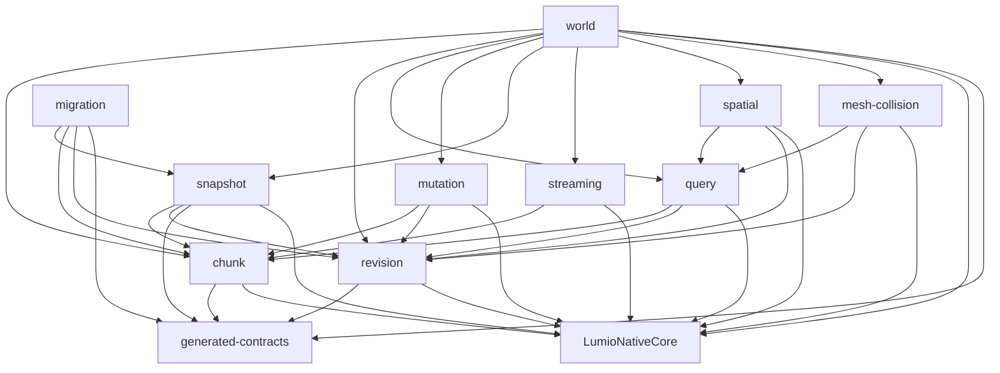

# LumioVoxelEngine 模块架构（模块总入口）

> **架构基线**：`LGE-V1.4-2026-08-27`
> **唯一架构源**：`LumioGameEngineArchitecture`（本仓只保存只读镜像 [docs/architecture/LumioGameEngine_Architecture_v1.4.md](../docs/architecture/LumioGameEngine_Architecture_v1.4.md)）
> **实现蓝图**：[docs/plans/lve-v1.4-implementation-blueprint.md](../docs/plans/lve-v1.4-implementation-blueprint.md)
> **本文定位**：LumioVoxelEngine 的模块文档总入口。公共语义引用架构源，本文只冻结本仓的模块边界、三张依赖图、状态所有权、线程/队列约束和文档维护规则。
> **内部决策**：Cut 与 CaptureRef 见 [0001](../.spec/decisions/0001-snapshotcut-vs-capture-ref.md)；CommitBatch 见 [0002](../.spec/decisions/0002-barrier-commit-batch.md)；分层与三图见 [0003](../.spec/decisions/0003-dependency-graphs-and-layering.md)；Snapshot Barrier 见 [0004](../.spec/decisions/0004-snapshot-short-barrier-vs-quiesce.md)；Origin Token 与队列矩阵见 [0005](../.spec/decisions/0005-origin-token-and-queue-matrix.md)；crate map 见 [0006](../.spec/decisions/0006-crate-map.md)；V1.4 实现基线见 [0007](../.spec/decisions/0007-v1.4-implementation-baseline.md)。

## 1. 设计目标、范围与审查结论

### 1.1 设计目标

- 把根 [README.md](../README.md) 声明的 VoxelWorld 能力拆成**单一状态所有者、单向编译依赖、可独立测试、故障边界清晰**的模块。
- 让开发者只阅读一个模块 README 就能回答：模块负责什么、不负责什么、拥有哪些状态、接受哪些输入、在哪个执行上下文运行、失败如何分类和恢复。
- 为 Foundation 阶段的 Rust crate 落地提供稳定的逻辑模块地图；物理 crate/文件布局可以在不改变边界的前提下演进。

### 1.2 范围

- 本目录覆盖 LumioVoxelEngine 的一等逻辑模块；每个模块一个目录，目录内的 `README.md` 是该模块的边界契约。
- 当前阶段只补充目录和 Markdown 文档，不包含 Cargo 工程、Rust 源码、配置、生成器、Schema 或测试实现。
- 模块 README 描述设计现状，不是新的公共 ABI、Wire Schema 或持久化格式来源。

### 1.3 当前架构审查结论

1. **总体方向可进入模块化设计阶段**：World/Chunk/Revision 的所有权、Server/Client 双实例隔离、Runtime Port 边界和 NativeCore 依赖方向一致。
2. **根 README 与架构源的粒度对齐**：架构源 §16 首批清单现为 `world/chunk/revision/query/mutation/snapshot/streaming`；`spatial`、`migration` 和 `mesh-collision` 仍是本仓实现粒度细化，不改变仓库所有权。
3. **`query` 必须独立**：只读批量查询拥有独立的预算、取消、缺 Chunk 结果和读取 Revision 语义，不能隐藏在 `chunk` 或 `world` 内部。
4. **`spatial` 与 `mesh-collision` 不等于 NativeCore 的通用 Kernel**：本仓只负责把 Chunk/Block/遮挡数据投影为 Voxel 领域结果；通用空间、碰撞和压缩算法仍归 NativeCore。投影只经 ReadView，不直连 Chunk Storage。
5. **`migration` 不在 Tick 热路径**：它提供 Voxel 节点语义；完整 DAG、Staging 目录、Checkpoint 索引和原子激活归 Host/Server。失败不得改写旧数据。
6. **公共 Voxel 契约已在 `LGE-V1.4-2026-08-27` 发布**：World/Port、Chunk/Page、Revision Stamp、Query、Mutation receipt 以及 Snapshot payload（ADR-035）与 Streaming DurabilityAck（ADR-036）均以架构源为准；模块 README 不再复制字段布局。Spatial/Mesh 仍无跨仓 Schema。

## 2. 系统上下文与仓库边界

LumioVoxelEngine 是七仓库体系中的 VoxelWorld 领域实现（架构源 §2.1）：

- **本仓拥有**：VoxelWorld、Chunk、Block、坐标、World/Chunk Revision、Query、Mutation、Voxel Snapshot/Diff payload、Streaming、Voxel Migration 节点，以及 Voxel Spatial/Collision Source。
- **Host 拥有**：进程、连接、Wall Clock、WorldSlot 和实例创建/销毁编排；本仓只提供实例内部状态转换和稳定 Port。
- **Runtime 拥有**：Logical Tick、Phase Graph、Coordinator、GameWorld、Replication 语义、跨域 `SnapshotCut` 和跨 World 决策；本仓不创建或直接修改 ECS，也不拥有 Session Cut。
- **CoreEngine/NativeCore 拥有**：Native 聚合加载、Root ABI 和领域无关的 Handle、Buffer、Job、空间、碰撞、压缩 Kernel；本仓消费 NativeCore 已发布 API 与架构源生成契约。
- **编译依赖**：`LumioVoxelEngine -> LumioNativeCore`；`LumioCoreEngine` 只消费本仓发布的 Schema/Artifact，不依赖本仓内部实现。Voxel 模块源码不得依赖 CoreEngine。
- **运行时关系**：`LumioCoreEngine package -> Host Loader -> VoxelWorld instance -> Runtime IVoxelWorldPort / generated Voxel Contract`。

所有模块都必须遵守以下约束：

1. Server 权威 VoxelWorld、Client VoxelReplicaWorld 与 LocalEmbedded 的两份世界不得共享对象引用、Chunk Buffer、锁、指针或 Revision 写入。
2. 权威修改只能在所属 Role 的 Simulation Barrier 提交；读操作也必须通过声明了预算、取消和 Revision 的 Port。
3. Native 锁内不得回调 C# 或 Hot Gameplay；Native Worker 只能返回有界、可取消、带 Revision 的结果。
4. Runtime/Server/Client 只能消费版本化 `IVoxelWorldPort` 和生成契约，不能读取内部 Chunk Storage。
5. 缺 Chunk 必须返回 `NotLoaded`、`Pending` 或 `Unavailable` 等明确结果，不能伪装为空世界。
6. 任何队列都必须声明容量、优先级、满载动作和 Metrics；禁止无界增长。

## 3. 模块地图与三张依赖图

禁止使用方向不明的「上游/下游」。边只表示：

- `depends on`：编译 / API 依赖。
- `called by`：控制流谁发起。
- `publishes / consumes`：事件和数据流。

### 3.1 模块地图

| 模块 | 一句话职责 | 层 | 物理 crate | 优先级 |
| --- | --- | --- | --- | --- |
| [world](world/README.md) | VoxelWorld 实例组装、Role/Context 生命周期、Barrier 入口和模块协调 | L5 组合根 | `lumio-voxel-world` | P0 |
| [chunk](chunk/README.md) | Chunk 坐标、Block 存储、页布局、压缩页和加载状态 | L1 基础数据 | `lumio-voxel-domain` | P0 |
| [revision](revision/README.md) | World/Chunk Revision、比较、读取令牌和 Snapshot Pin/COW 记录 | L1 基础数据 | `lumio-voxel-domain` | P0 |
| [query](query/README.md) | 有界只读批量查询、缺 Chunk 结果、读取 Revision 和取消 | L3 领域 API | `lumio-voxel-ops` | P0 |
| [mutation](mutation/README.md) | 单域修改、Prepare/Reservation、幂等 Commit/Abort 和 CommitBatch | L3 领域 API | `lumio-voxel-ops` | P0 |
| [snapshot](snapshot/README.md) | VoxelCaptureRef、Diff、Canonical 编码、校验和恢复输入 | L3 持久化数据 | `lumio-voxel-ops` | P0 |
| [streaming](streaming/README.md) | Chunk Load/Unload、优先级、预算、取消、背压和可用性 | L3 生命周期服务 | `lumio-voxel-ops` | P2 |
| [spatial](spatial/README.md) | Voxel 候选、遮挡投影和带 Revision 的空间 Source | L4 领域投影 | `lumio-voxel-project` | P2 |
| [migration](migration/README.md) | Voxel Migration 节点输入/输出、转换器和节点级校验 | Tool 路径 | `lumio-voxel-migration` | P2 |
| [mesh-collision](mesh-collision/README.md) | Mesh/Collision Source 构建、缓存和任务，不拥有 Gameplay 规则 | L4 领域投影 | `lumio-voxel-project` | P2 |

“优先级”表示实现顺序，不表示代码已经存在或已交付。逻辑模块不必与物理 crate 1:1；七 crate 落点见 [0006](../.spec/decisions/0006-crate-map.md)、[0007](../.spec/decisions/0007-v1.4-implementation-baseline.md) 与 [实现蓝图](../docs/plans/lve-v1.4-implementation-blueprint.md)。Query/Mutation 属 `lumio-voxel-ops`，L2 ReadView/WriteSet/CommitBatch 属 `lumio-voxel-domain`。

### 3.2 Compile-Time DAG

`A --> B` 表示 A 编译/API 依赖 B。`chunk` 与 `revision` 是 sibling，不互调。`world` 是组合根；L0–L4 与 Tool 不得依赖 `world`。不存在指向 `LumioCoreEngine` 的编译边。



补充约定：

- `revision` 不依赖任何上层 Voxel 模块，也不依赖 `chunk`。
- `chunk` 只拥有数据布局和 Chunk 内部状态，不暴露 Storage 引用，不递增公共 Revision。
- `query`、`mutation` 通过 ReadView / WriteSet 消费 `chunk`，不调用 `world` 的生命周期方法。
- `snapshot` 负责 CaptureRef、编码和解码输入；文件、fsync、原子替换和 WAL 落盘由 Host/Runtime 的持久化编排负责。
- `streaming` 负责请求调度和 Chunk 可用性任务，不拥有 World 生命周期；`world` 决定何时启动、排空和关闭它。
- `spatial`、`mesh-collision` 只经 `query` ReadView 读取体素，最终 AOI、权限、渲染和 Gameplay 决策在上层完成。
- `migration` 可在工具进程或维护阶段运行，不得从 Tick 热路径回调 `world` 写入。
- NativeCore 只提供通用 Kernel；Voxel 语义、Revision 和失败原因仍由本仓定义。

### 3.3 Runtime Control Flow

谁发起调用，谁完成调用。箭头是控制流，不是编译边。

```text
Host create/destroy
  -> world lifecycle
  -> init revision + chunk
  -> register query + mutation + snapshot
  -> optional streaming / spatial / mesh-collision

IVoxelWorldPort.query
  -> world Barrier / Context check
  -> query
  -> ReadView(chunk) + Stamp(revision)

IVoxelWorldPort.prepare / commit / abort
  -> world
  -> mutation
  -> CommitBatch publish { chunk pages, Dirty, ChunkRevisionSet, WorldRevision }

CrossWorldTxn
  -> Runtime Coordinator owns CommitIntent + TxnJournal
  -> mutation as participant: Prepare / Apply / Abort / Duplicate receipt

Running Snapshot
  -> Runtime fixes SnapshotCut
  -> world.capture(cut)
  -> revision.pin
  -> snapshot holds VoxelCaptureRef
  -> resume writes
  -> background encode / verify
  -> Host persist

Quiesce / maintenance Snapshot
  -> world closes Ingress and new writes
  -> drain or abort Reservation
  -> same Cut -> CaptureRef path as above

Restore
  -> Host supplies immutable bytes
  -> snapshot.decode
  -> world restore entry
  -> chunk.materialize_pages + revision.restore_stamps
  (not streaming Load)

Streaming Load/Unload
  -> world or Host submits request
  -> streaming queue / IO worker
  -> Barrier publish on chunk
  -> Dirty Unload only after Host durability ack

Spatial / Mesh
  -> world routes
  -> spatial or mesh-collision
  -> query ReadView
  -> NativeCore Kernel

Migration
  -> Host orchestrates DAG / Staging / activation
  -> migration runs node executor only
```

### 3.4 Event / Data Flow

```text
mutation publishes ChunkChanged
  -> snapshot Diff index consumes
  -> spatial / mesh-collision invalidate caches
  (mutation does not call those modules)

streaming publishes AvailabilityChanged
  -> query / spatial / mesh-collision consume
  (query does not request Load)

Host publishes DurabilityAck(SnapshotId or WAL offset, ChunkId set)
  -> world Barrier
  -> chunk.clear_dirty

snapshot publishes CaptureReady(Canonical bytes + Header)
  -> Host persistence consumes
  -> migration node input is the immutable Artifact, not a live World
```

### 3.5 关键调用链

1. **创建**：Host 分配句柄和 Capability → `world` 建立实例上下文 → 初始化 `revision/chunk` → 注册 `query/mutation/snapshot` → 按能力挂接 P2 `streaming/spatial/mesh-collision` → 返回 `VoxelWorldHandle`。
2. **只读查询**：`IVoxelWorldPort` → `world` 校验 Context/预算 → `query` 读取 ReadView 和 `revision` Stamp → 返回 typed batch、读取 Revision 和缺 Chunk 状态；不会返回内部指针。
3. **单域修改**：Runtime Barrier → `world` 转交 `mutation.prepare` → 校验 Chunk/Cell/Expected Revision 并创建不可见 Reservation → Coordinator 或单域调用方决定 Commit → `mutation.commit` 经 CommitBatch 原子发布页与 Revision → 返回新 World/Chunk Revision。
4. **CrossWorldTxnV1**：Runtime 持有协调状态和 `CommitIntent`；Voxel 侧只执行 Prepare/Reservation/Apply/Abort 并记录 participant receipt。固定顺序为 `VoxelCommit -> EcsCommandBufferCommit`，重复 `TxnId` 返回原结果。
5. **运行中 Snapshot**：Runtime 在协调 Barrier 固定 `SnapshotCut` → `world` 请求 Pin/COW 并取得 `VoxelCaptureRef` → 恢复写入 → `snapshot` 后台编码带 Revision 的 Canonical bytes → 交给 Host 持久化。
6. **Streaming**：上层提交带优先级和截止条件的 Load/Unload → `streaming` 放入有界队列 → IO/解压完成后在 Barrier 发布 Chunk 可用性 → `query` 明确返回 `Ready/NotLoaded/Pending/Unavailable`。
7. **空间与几何**：`spatial` 或 `mesh-collision` 经 `query` 读取指定 Revision 的 ReadView → NativeCore Kernel 计算 → 返回带 Revision、预算和取消原因的 Source；上层再做权限/AOI/渲染过滤。
8. **迁移**：Host 从不可变 `SnapshotId + SessionRevisionVector` 调度 DAG → 调用 Voxel 节点 executor → Staging 校验与原子激活由 Host 完成；任何失败都保留旧 Active 指针。
9. **恢复**：Host 提供不可变字节 → `snapshot.decode` → `world` restore 入口 → `chunk` 物化页、`revision` 恢复 Stamp。
10. **销毁**：先关闭 Ingress 并停止新写入 → 完成/中止 Reservation → 导出诊断与 Snapshot 元数据（向 Host，不在 world 内缓存 Cut）→ 停止 Streaming/构建任务 → 释放 Chunk/Revision → 使所有旧 Handle 失效。

## 4. 状态所有权与故障域

| 状态或资源 | 唯一所有者 | 边界说明 |
| --- | --- | --- |
| World 实例句柄、Role、Context、生命周期 | `world` | 只保存模块句柄、Capability view 和 Barrier gate，不复制模块状态，不缓存 Cut |
| Chunk/Block/坐标/页布局/加载态/Dirty | `chunk` | Storage 私有；Dirty 仅在 Host DurabilityAck 后由 Barrier 清除 |
| WorldRevision、ChunkRevision、读取令牌、Pin/COW 记录 | `revision` | 不允许无语义的统一整数替代域 Revision；不拥有 Block 页 |
| 查询预算、批次、取消和缺 Chunk 结果 | `query` | 只读，不产生可见写入，不控制 Load |
| Mutation Batch、Reservation、Prepare Token、participant receipt | `mutation` | Prepare 无可见副作用；不拥有全局 CommitIntent |
| VoxelCaptureRef、Diff、Canonical 编码/解码上下文 | `snapshot` | 不拥有跨域 SnapshotCut、Pin 记录、文件耐久与 WAL |
| Load/Unload 请求、优先级、预算、背压和取消 | `streaming` | 不改变上层 World 生命周期，不拥有 WAL，不得卸载未获 ack 的 Dirty |
| Voxel 候选、遮挡投影、Spatial Source 缓存 | `spatial` | 不做最终 AOI/权限裁决；缓存 scoped 到 World Context |
| Voxel migration 节点局部输入/输出/校验结果 | `migration` | 不拥有 Staging 目录、全图 DAG、Active 指针或重启扫描 |
| Mesh/Collision Source、构建任务和缓存 | `mesh-collision` | 不拥有 Renderer、Physics Gameplay 或材质规则 |
| 跨域 SnapshotCut、SessionRevisionVector | Runtime Coordinator | Voxel 只接收不可变 Cut 描述 |
| 文件/目录、fsync、原子替换、WAL/Command Log、DurabilityAck | Host/Runtime 持久化编排 | Voxel 模块只提供 Canonical bytes 和元数据 |
| Diagnostic/Audit/Metrics/Trace Sink | 上层观测管道 | Voxel 模块只发带关联字段的事件 |

故障按最小影响范围处理：单次 Query/Mutation → Chunk/Streaming → World 实例 → 进程。连接、Session、Release Pool 和进程级重启不在本仓裁决；本仓必须提供稳定错误、Revision、Failure Bundle 片段和可重放输入。

## 5. 执行上下文、线程与有界队列

```text
Host/Runtime Simulation Owner Thread
  -> world Barrier Gate
  -> query / mutation / revision
  -> bounded Native Job / Completion (NativeCore)
  -> snapshot encode or spatial/mesh projection
  -> Host Runtime/Network Egress

Streaming IO Worker(s)
  -> bounded Load/Unload Queue
  -> world Barrier publication

Migration Tool / Maintenance Worker
  -> immutable Snapshot input
  -> node-local staged payload
  -> Host atomic activation request
```

- `world` 不自行拥有 Host Wall Clock；Host 决定何时 Tick，Runtime 决定 Phase，Voxel 只在所属 Barrier 接受权威写入。
- `query` 可以在受控的只读快照上异步执行，但结果必须带读取 Revision、预算消耗、超时和取消原因。
- `mutation` 的 Reservation 状态只能由其拥有的执行上下文修改；不得跨 FFI 持有 Rust 锁，也不得把可变引用放入异步结果。
- `streaming` 的 IO/解压线程只生产完成事件；Chunk 状态转换在 Barrier 发布，避免后台线程直接改权威状态。
- Snapshot 编码、Spatial 和 Mesh/Collision 构建可使用 Native Job，但 Completion 只能在声明的 Barrier 应用。
- 所有队列声明容量、优先级、满载动作和 Metrics；Unreliable/诊断结果可按策略丢弃，权威 Mutation、TxnJournal 和已确认 Snapshot 不得静默丢失。
- 同步 P0 可以关闭异步 Query/Streaming/投影能力；开启异步后每个任务必须携带 [0005](../.spec/decisions/0005-origin-token-and-queue-matrix.md) 的 Origin Token，迟到结果不得写入新实例。

## 6. 公共契约与架构来源

下列内容仍由 `LumioGameEngineArchitecture` 维护；本仓只消费生成结果或通过版本化 Port 暴露，不在模块 README 中复制字段定义：

| 契约 | 架构源位置（外部仓库） | 本仓消费模块 |
| --- | --- | --- |
| `SessionRevisionVector` | `schemas/common.schema.json` / `schemas/session-revision-vector.schema.json` | revision、snapshot、mutation、query |
| `CrossWorldTxnV1` | `schemas/cross-world-txn.schema.json` | mutation、world |
| `SnapshotHeader` | `schemas/snapshot-header.schema.json` | snapshot、migration |
| `NativeManagedAbiV1` | `schemas/native-managed-abi.schema.json` | world、chunk、snapshot、streaming |
| `HostCapability` | `schemas/host-capability.schema.json` | world、streaming、spatial、mesh-collision |
| `MigrationManifest` | `schemas/migration-manifest.schema.json` | migration |
| `FailureBundle` / Logging Event | `schemas/failure-bundle.schema.json`、`schemas/logging-event.schema.json` | 全部模块的错误和诊断 |
| ID Registry | `ids/index.json` | world、chunk、revision、mutation |
| Voxel World/Port | `schemas/voxel-world-port.schema.json` | world |
| Voxel Chunk/Page | `schemas/voxel-chunk-page.schema.json` | chunk、query、streaming |
| Voxel Revision Stamp | `schemas/voxel-revision-stamp.schema.json` | revision、query、mutation、snapshot |
| Voxel Query | `schemas/voxel-query.schema.json` | query |
| Voxel Mutation Receipt | `schemas/voxel-mutation-receipt.schema.json` | mutation |
| Voxel Snapshot Payload | `schemas/voxel-snapshot-payload.schema.json`（ADR-035，随 `LGE-V1.4-2026-08-27` 冻结） | snapshot |
| Voxel DurabilityAck | `schemas/voxel-durability-ack.schema.json`（ADR-036，随 `LGE-V1.4-2026-08-27` 冻结） | streaming、chunk |

模块 README 不得复制上述 Schema 的字段布局；只引用 `$id` 与本仓方法名。Spatial/Mesh 仍无跨仓 Schema。

## 7. 模块 README 文档契约

每个模块 README 必须保持以下顺序，内容只写当前有效设计，不写实现历史：

1. 模块定位与目标。
2. 负责什么。
3. 明确不负责什么。
4. 拥有的状态与资源。
5. 输入、输出与稳定接口（候选接口必须注明仍待公共 Schema/ADR 冻结）。
6. 依赖（编译 / 控制流 / 事件与数据）；禁止「上游/下游」。
7. 生命周期与状态机。
8. 线程、队列与并发所有权。
9. 正常数据流与失败路径。
10. 错误分类、恢复与降级。
11. 配置、Capability 与安全约束。
12. 日志、Metrics、Trace 与 Audit。
13. 测试面、故障矩阵与性能指标。
14. 对应 ADR、Schema 与 Fixture。
15. 尚未批准的决策门。

模块 README 不是实现任务清单；待执行工作使用 `.spec/tasks/`，架构决策使用 `.spec/decisions/`，公共语义决策使用架构源 ADR。

## 8. 决策门与版本演进

以下是本仓模块化设计的临时决策门。它们不是架构源公共语义，也不是已批准的性能承诺；确认后应在 [.spec/decisions/](../.spec/decisions/README.md) 新增 ADR，并同步受影响模块 README。

| ID | 待决问题 | 临时边界 | 主要模块 | 批准条件 |
| --- | --- | --- | --- | --- |
| VOX-D-001 | Chunk 数值 profile（维度、世界边界、页大小） | 线格式已由架构源 ADR-024 冻结；消费者仍不得依赖具体尺寸 | chunk、query | Bench 卡确认数值，写入配置快照 |
| VOX-D-002 | Block 存储与压缩后端 | 通过 Adapter/页接口隔离，优先 OSS，保持确定性 | chunk | 密度、CPU、内存和许可证 Benchmark |
| VOX-D-003 | Query 批次、预算默认值 | 一致性与缺 Chunk 四态已由架构源 ADR-024 / `voxel-query` 冻结；容量仍开放 | query、streaming | Bench 后写入配置快照 |
| VOX-D-004 | Reservation 租约与 receipt 表容量 | 崩溃恢复与 pruning 已由架构源 ADR-025 冻结；租约/表上限仍开放 | mutation | NativeHeadless 容量与活性测试 |
| VOX-D-005 | Snapshot Pin/COW 与子 chunk Diff 粒度 | 载荷线格式已由架构源 ADR-035 交付；物化策略仍开放（D-014） | snapshot、revision | 内存放大与 Diff 体积基准 |
| VOX-D-006 | Streaming 优先级、并发和背压阈值 | 耐久栅栏已由架构源 ADR-036 交付；评分/阈值仍开放（D-014） | streaming | NativeHeadless 压测和故障矩阵 |
| VOX-D-007 | Spatial/Collision Kernel 适配与缓存键 | 只缓存带 Revision 与 World Context 的 Source，不缓存 Gameplay 判定 | spatial、mesh-collision | Native Differential 与性能基线 |
| VOX-D-008 | Voxel Migration 节点粒度 | Manifest 已含 hash/toolVersion；节点切分仍开放 | migration | Crash-at-node 与大世界基准 |

已经冻结、不再当作决策门的内部边界见 [0001](../.spec/decisions/0001-snapshotcut-vs-capture-ref.md)–[0007](../.spec/decisions/0007-v1.4-implementation-baseline.md)。

公共状态、字段、错误、时序、ID、Schema 或依赖图的变化必须先回到架构源；本仓内部边界变化也不得只改一个 README 而不更新本文和 ADR 索引。

## 9. 实现节奏与文档退出条件

1. **Architecture Gate**：消费 `LGE-V1.4-2026-08-27` 已冻结的 World/Chunk/Revision/Mutation/Snapshot 公共语义、Voxel 专属 Schema、正向/失败 Fixture 和 Port 错误表。
2. **Foundation**：实现 `revision/chunk/world/query/mutation/snapshot` 的单域闭环，Reference Port 和 NativeHeadless 语义测试可运行。P0 Profile 可全驻留并禁用 Dirty Unload。
3. **Vertical Slice**：以 `PlaceVoxelAbility` 接入 CrossWorldTxn、Local 双实例、Snapshot/WAL、Reference Differential 和恢复路径。
4. **Production Hardening**：完成 Streaming、Spatial、Migration、损坏注入、背压、性能曲线和长期运行验证。
5. **P2**：实现复杂 Voxel-aware AOI、Mesh/Collision 优化和可替换后端；不得改变 V1 权威边界。

进入代码实现前，文档层至少满足：

- 每个模块都有独立 README，且链接、责任和状态所有权与本文一致。
- 每个 P0 模块都有稳定 Port 表面、生命周期、失败路径和测试面。
- 所有公共契约引用都指向架构源和 `LGE-V1.4-2026-08-27`；Snapshot payload 与 DurabilityAck 已随 ADR-035/036 冻结，不再标为下一 BaselineId。
- LocalEmbedded 双实例、Revision 一致性、缺 Chunk、Prepare/Commit 顺序和 Snapshot Cut 的边界没有互相矛盾。
- 代码引入时另行执行 Rust toolchain、`rustfmt`、`clippy`、测试与契约校验要求；本次文档补充不改变这些门槛。

## 10. 文档维护规则

- 模块 README 只描述设计现状；决策原因和历史放在 ADR，不在 README 里累积变更日志。
- 根 README 只保留仓库级边界和模块入口；新增/删除模块必须同时更新根 README、本文件和对应依赖图。
- 公共架构镜像只读；发现冲突时先在 `LumioGameEngineArchitecture` 完成 Architecture Gate，再同步镜像和本仓文档。
- 本目录当前是文档骨架，未承诺任何尚不存在的 Rust API、性能数字或第三方依赖。
